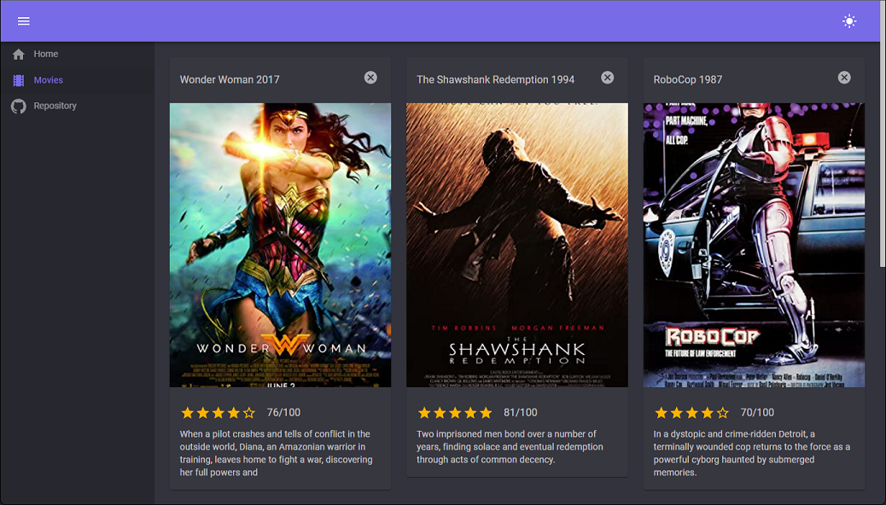

# blazor-movie-client

Blazor webAssembly client application using [MudBlazor](https://mudblazor.com/) components and consuming [OmdbApi](https://www.omdbapi.com/)

## Configuration

Get an API KEY from `OmdnApi` and use in service implementation `OmdbFinder.cs`

- 📂Services 
  - 🗒️[OmdbFinder.cs](./Services/OmdbFinder.cs) 

## Screenshots

