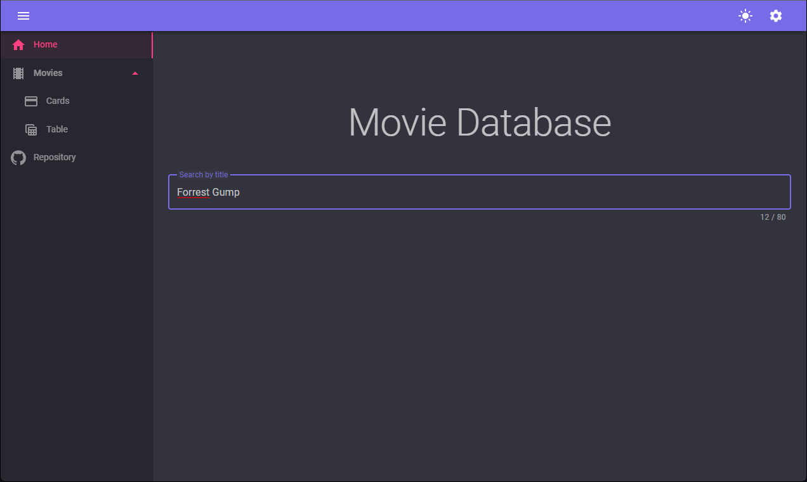

# blazor-movie-client

Blazor webAssembly client application using [MudBlazor](https://mudblazor.com/) components and consuming [OmdbApi](https://www.omdbapi.com/)

## Configuration

Get an API KEY from `OmdnApi` and enter settings value

 

## Screenshots

 
 
 